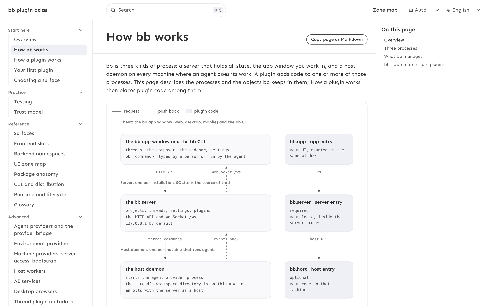
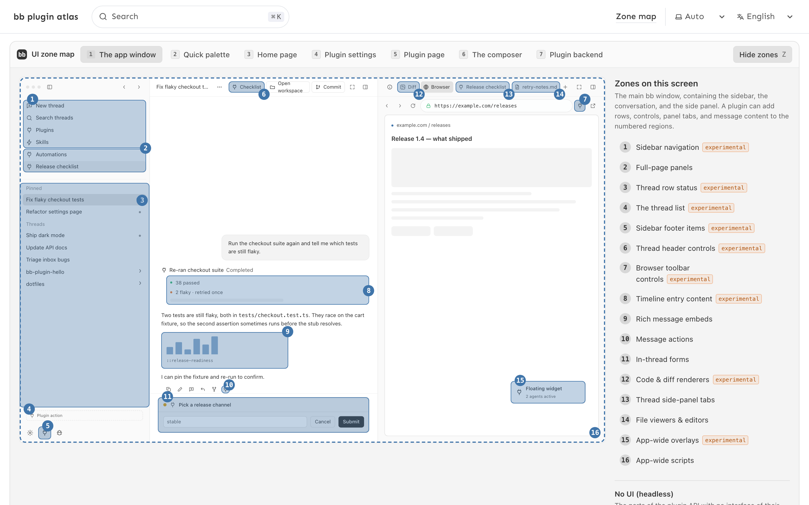

# bb Plugin Atlas

A guide to the [bb](https://getbb.app) plugin SDK: what a plugin is made of, where it runs, every surface it can render into, and what it is allowed to touch. Written for a developer who knows TypeScript and React and has never written a plugin, in the order that builds a working mental model: how bb works, how a plugin works, a first plugin, then the reference.

The reference is generated from the bb repository at a pinned release, so every symbol links to the line it is declared on. Each surface, slot and namespace also produces a brief that can be pasted into a coding agent. Currently documenting **bb 0.43.3**, `@get-bb/plugin-sdk` **0.4.104**, tag [`desktop-v0.43.3`](https://github.com/get-bb/bb/tree/desktop-v0.43.3) of [get-bb/bb](https://github.com/get-bb/bb).





English at `/`, Russian at `/ru/`.

## Running it

```bash
pnpm install
pnpm --filter site dev       # http://localhost:4321; search only works in a production build
pnpm build
pnpm verify                  # typecheck, build, tests, Playwright
```

How the site is put together, what is generated and what is written by hand, and how to move it to a new bb release: [docs-internal/HOW-IT-WORKS.md](docs-internal/HOW-IT-WORKS.md). Issues and pull requests: [CONTRIBUTING.md](CONTRIBUTING.md).

## License

MIT for the code. The prose is the author's own work and carries the same terms; quotations from the bb repository remain under bb's license and link to their source.

Not affiliated with the bb project.
